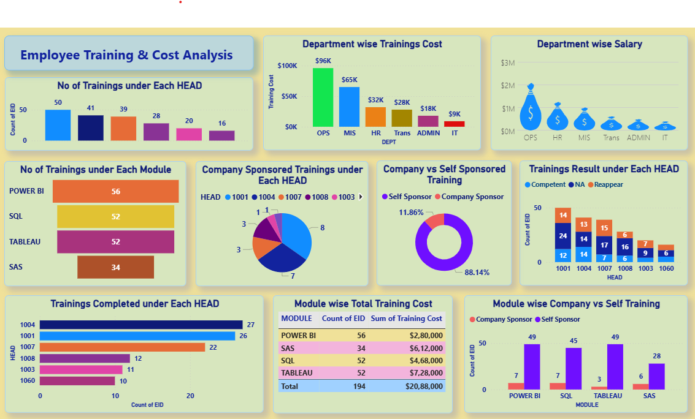
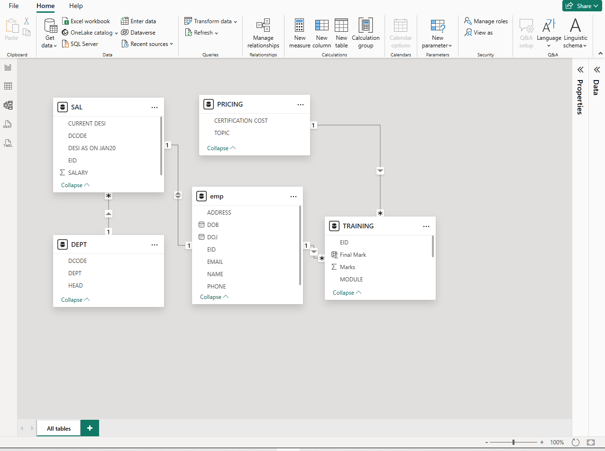

# 📊 Employee Training and Cost Analysis Dashboard (Power BI)

## 📌 Project Overview

This project presents a comprehensive **Employee Training and Cost Analysis Dashboard** built using **Power BI**. It provides insights into employee training participation, departmental costs, and sponsorship distribution to support data-driven decision-making.

The dashboard is powered by structured datasets and an optimized data model to deliver clear and actionable business insights.

---

## 📸 Dashboard Preview

<p align="center">
  
</p>

---

## 🧩 Data Model

<p align="center">
  
</p>

---

## 🗂️ Data Sources

The project uses structured data from Excel files:

* EMP.xlsx – Employee details
* EMPSAL.xlsx – Salary information
* TRG.xlsx – Training records

---

## ⚙️ Tools & Technologies Used

* **Power BI Desktop**
* **Power Query** – Data cleaning & transformation
* **Power Pivot** – Data modeling
* **DAX** – Calculated measures and KPIs
* **Excel / CSV** – Data sources

---

## 🔄 Data Preparation

* Cleaned and transformed raw data using Power Query
* Handled missing values and duplicates
* Standardized data formats
* Established relationships between datasets

---

## 🧠 Data Modeling

* Built a **star schema model**
* Defined relationships between:

  * Employee ↔ Salary
  * Employee ↔ Training
* Optimized model for performance and scalability
* Created DAX measures for analysis

---

## 📈 Dashboard Features

### 📊 Training Analysis

* Number of trainings under each head
* Module-wise training distribution
* Training completion status
* Training results overview

### 💰 Cost Analysis

* Department-wise training cost
* Department-wise salary comparison
* Module-wise total training cost

### 🏢 Sponsorship Insights

* Company-sponsored trainings distribution
* Company vs self-sponsored comparison
* Module-wise sponsorship cost analysis

---

## 🧩 Training Modules Covered

* Power BI
* SAS
* SQL
* Tableau

---

## 📊 Key Insights

* Identifies departments with highest training investment
* Highlights employee participation trends
* Compares company vs self-sponsored training costs
* Evaluates training performance and outcomes

---

## 🚀 How to Use

1. Download the `.pbix` file from the `dashboard` folder
2. Open in Power BI Desktop
3. Refresh data if needed
4. Interact with filters and visuals

---

## 📁 Project Structure

```
Employee-Training-Cost-Dashboard
 ┣ 📂 dashboard
 ┃ ┗ Employee-Training-Cost-Dashboard.pbix
 ┣ 📂 data
 ┃ ┣ EMP.xlsx
 ┃ ┣ EMPSAL.xlsx
 ┃ ┗ TRG.xlsx
 ┣ 📂 images
 ┃ ┣ dashboard.png
 ┃ ┗ Data_Model.png
 ┗ README.md
```

---

## 🎯 Future Enhancements

* Integration with real-time data sources
* Advanced analytics and forecasting
* Enhanced dashboard UI/UX
* Role-based access control

---

## 🤝 Contributing

Contributions are welcome! Feel free to fork this repository and submit a pull request.

---

## 📬 Contact

For any queries or feedback, feel free to connect.
